  

<table>
<tr>
<td valign="top"></td>
<td valign="top"></td>
</tr>
</table>

## Fabián Lara Figueroa

**Civil Computer Engineer · AI Agent Systems · Full-Stack**

 

<!-- animated contribution graph, refreshed daily by the workflow -->

---

## 👋 Hi there

Civil Computer Engineer from Universidad de Valparaíso 🇨🇱, passionate about building AI-powered systems and full-stack applications.

💻 I specialize in designing and developing **LLM-based chatbots and agent architectures** using LangGraph and LangChain on NestJS backends — currently building an intelligent medical scheduling assistant.

🧠 My interests lie in **applied AI, prompt engineering, LLM agent patterns**, and scalable backend systems with TypeScript, Prisma, and PostgreSQL.

---

## 🛠️ Tech Stack

**Languages**

**Frameworks & Libraries**

**AI / LLM**

**Databases & Infrastructure**

---

## 👨‍💻 Repositorios destacados

  

  

---

## 📊 GitHub Stats

> **Note:** Top languages only reflect my public code and don't represent my full skill set.

---

<picture>
  <source media="(prefers-color-scheme: dark)" srcset="https://raw.githubusercontent.com/zThorium/zThorium/output/github-snake-dark.svg" />
  <source media="(prefers-color-scheme: light)" srcset="https://raw.githubusercontent.com/zThorium/zThorium/output/github-snake.svg" />
  
</picture>
